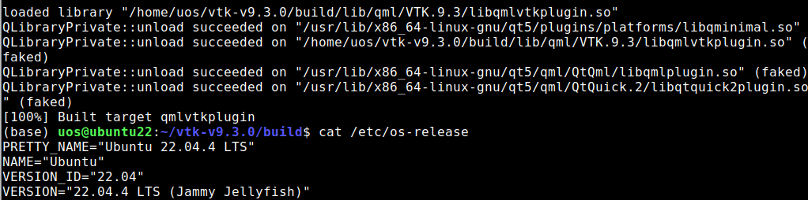
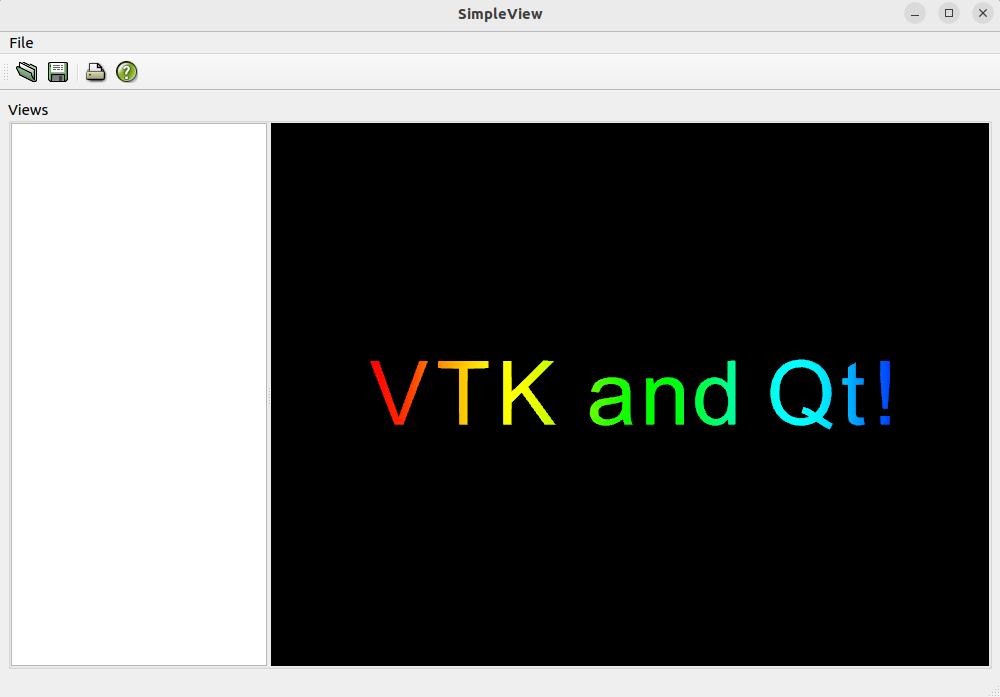
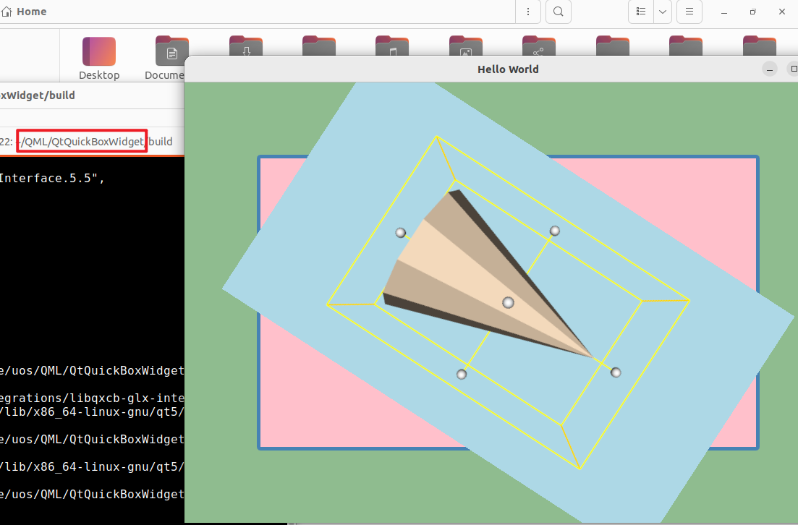

# 说明

1. 下载源码

   从https://gitlab.kitware.com/vtk/vtk/上面下载VTK 9.3.0的源码。

2. 安装依赖包

   构建环境为ubuntu 22.04

   2.1 安装OpenGL参考[ubuntu如何安装opengl](https://blog.csdn.net/slty_123/article/details/136032771)

   2.2 使用如下命令安装依赖包

```bash
sudo apt install build-essential qtbase5-dev qtdeclarative5-dev libqt5quick5 libqt5quickcontrols2-5 cmake libxcursor-dev

```

3. 在下载后的源码包中使用如下命令构建：

   cmake -LAH  可以列出所有的缓存变量，包括编译选项及默认值等。

```bash
cmake .. -DCMAKE_BUILD_TYPE=Release -DBUILD_SHARED_LIBS=ON -DVTK_GROUP_ENABLE_Qt=YES -DCMAKE_PREFIX_PATH=/usr/lib/qt5
```

如果在使用make编译时报qml的错误，请使用以下命令安装

```bash
sudo apt install qml-module-qtquick*
```

# 测试结果



编译成功后，使用**sudo make install**安装

在vtk源码目录Examples自带的2个工程SimpleView和QtQuickBoxWidget编译后运行结果如下：






# 参考

1. [ubuntu手动编译VTK9.3](https://www.8kiz.cn/archives/22084.html)
2. [ubuntu如何安装opengl](https://www.8kiz.cn/archives/22084.html)

3. [安装VTK遇到的qml报错的问题](https://blog.csdn.net/qq_39174336/article/details/135490742)
